# TAKwerx Market for ATAK — User Guide

**Version 1.1 · takwerx**

**Download TAKwerx Market 1.1** (pick the one matching your ATAK-CIV version, sideload, then load it in ATAK's Plugins manager):

- **ATAK-CIV 5.6:** https://github.com/takwerx/takwerx-market/releases/download/v1.1/ATAK-Plugin-TakwerxMarket-1.1--5.6.0-civ-release.apk
- **ATAK-CIV 5.7:** https://github.com/takwerx/takwerx-market/releases/download/v1.1/ATAK-Plugin-TakwerxMarket-1.1--5.7.0-civ-release.apk
- **ATAK-CIV 5.8:** https://github.com/takwerx/takwerx-market/releases/download/v1.1/ATAK-Plugin-TakwerxMarket-1.1--5.8.0-civ-release.apk

All releases: https://github.com/takwerx/takwerx-market/releases

TAKwerx Market lists every takwerx ATAK plugin, shows which of them run on the
ATAK you are holding, and installs them without leaving ATAK. Sideload this one
plugin and you can get the rest from inside the app. It also tells you when
something you already have is out of date, and lets you load, unload or remove a
plugin from the same list.

---

## Before you start

Published builds exist for **ATAK-CIV 5.6, 5.7 and 5.8**. Plugins are matched to
the ATAK release they were built against, so download the one for the ATAK
version on your device — a mismatch will not load, and the failure does not look
like a version problem.

The market needs outbound HTTPS to read the catalog and to download a plugin.
No account, no key, no configuration, and no TAK server involvement. It does not
read or transmit your position, callsign, or anything else; it only fetches.

---

## The toolbar and the startup notice

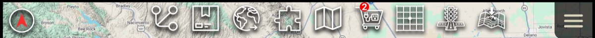

The market icon carries a red count whenever updates are waiting, drawn the way
ATAK badges its own tools.

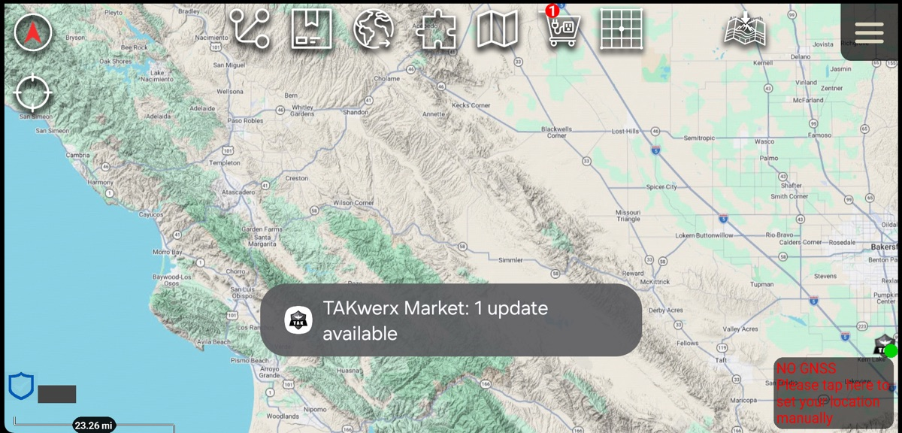

When ATAK starts, the market checks the catalog quietly in the background. If
anything you have is out of date it says so once, then leaves you alone. If
everything is current it says nothing at all.

---

## The pane

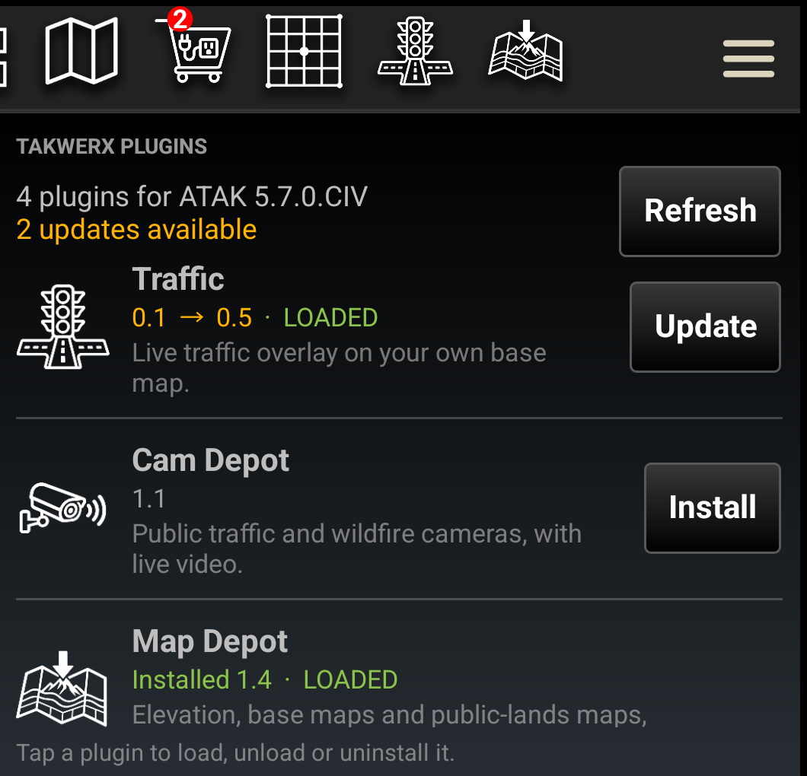

Open it from the toolbar. The header says how many plugins are available for
your ATAK, and under it whether any have updates waiting. The count on the
toolbar icon is the same number.

Each row is one plugin: its name, its version, and what the market can do about
it.

- **Amber** with an arrow, `0.1 → 0.5`, means an update is available: what you
  have beside what is on offer, and an **Update** button.
- **Green** `Installed 1.4 · LOADED` means you are current and the plugin is
  running in ATAK. No button, because there is nothing to do.
- A plain version with an **Install** button is a plugin you do not have.

**Refresh** re-reads the catalog if you want to check again immediately.

### Why some plugins are not offered

ATAK plugins are built against one ATAK release and only load on that release.
The market reads the ATAK you are running and offers only what matches it.
Anything built for a different ATAK is still listed, greyed out, saying which
release it was built for. It is not hidden: a list that silently drops things
reads as though nothing else exists.

---

## Installing and updating

Tap **Install** or **Update**. The market downloads the plugin, checks it, and
hands it to Android. The row shows the download as it happens.

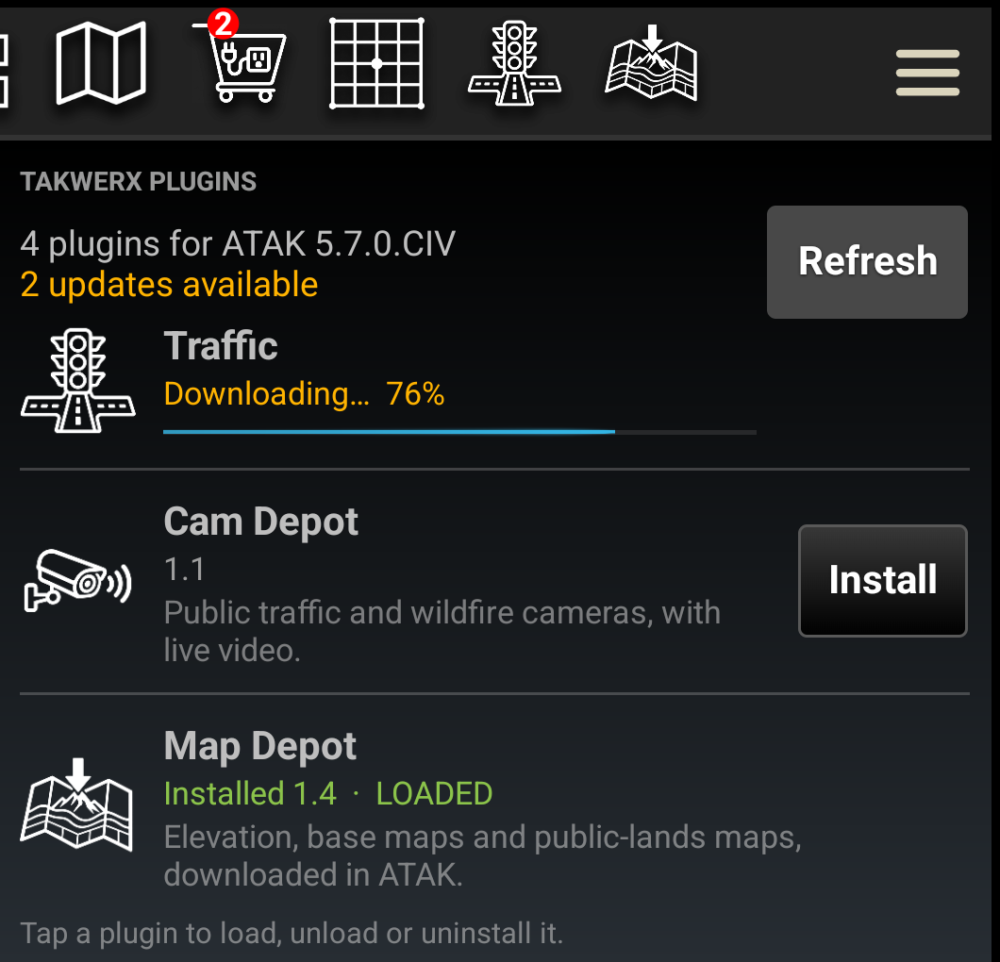

Two things are checked before Android is ever asked. The download must match
the fingerprint published in the catalog, so a truncated or altered file is
discarded rather than installed. And the plugin must be signed by the TAK
Product Center: everything in the market is built and signed by tak.gov from
published source, and anything else is refused, with the reason shown.

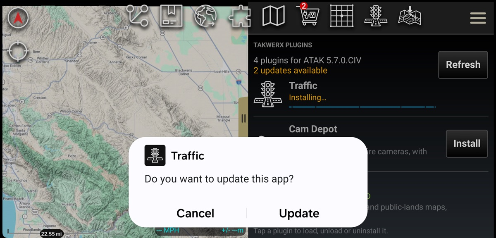

Android then asks you to confirm. That prompt is Android's own and cannot be
skipped: no app on your phone can install another one silently. On some devices
you are asked once to allow ATAK to install apps; allow it and you will not be
asked again.

### What you will see next

Three things happen in a row, and all three are normal.

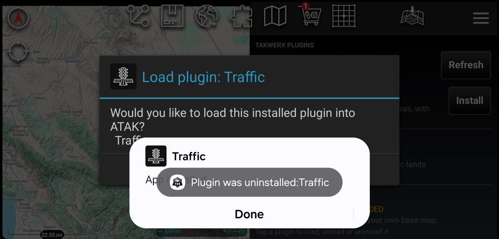

1. **Android's "App installed" screen.** Tap **Done**.
2. **A toast saying the plugin was uninstalled.** During an update ATAK notices
   the old copy being replaced and says so. Nothing has gone wrong; the market
   row underneath says *Installing…* for exactly that reason.

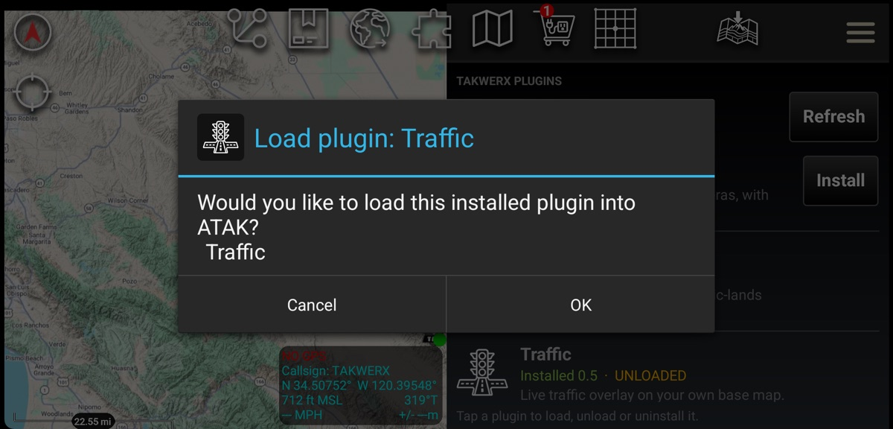

3. **ATAK asks "Load plugin?"** This is the same question it asks after any
   install, from any source. Say **OK**.

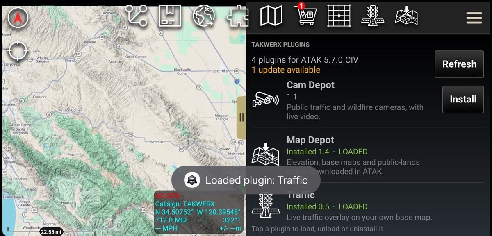

The row turns green with **LOADED** and the toolbar count goes down by one. The
row updates on its own; you do not need to reopen the market or refresh it.

---

## Unloading and uninstalling

Tap the **row** itself, on the plugin's name rather than its button, to get the
actions for a plugin you already have.

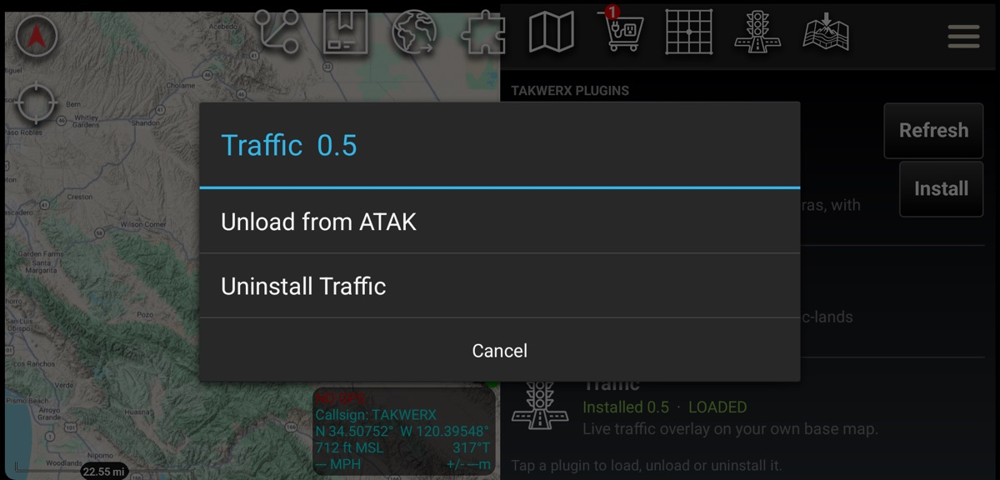

That is the same set of things ATAK's own plugin manager offers, without
leaving the market.

**Unload from ATAK** takes a plugin out of the running ATAK but leaves it on the
phone. The row says **UNLOADED** in amber, and the same menu offers to load it
again.

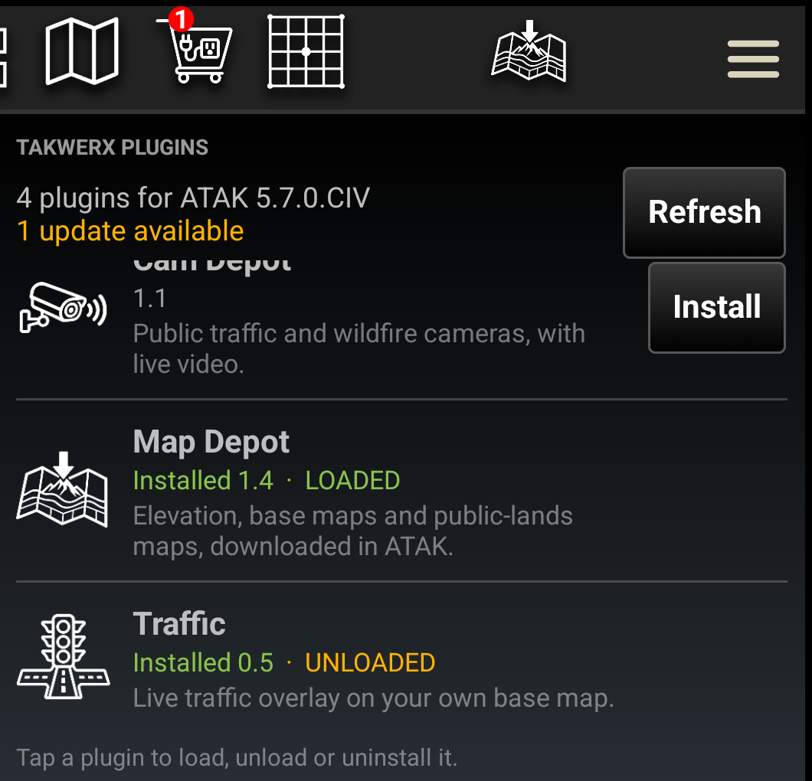

**Uninstall** removes it from the phone. Android asks you to confirm, as it does
for any app.

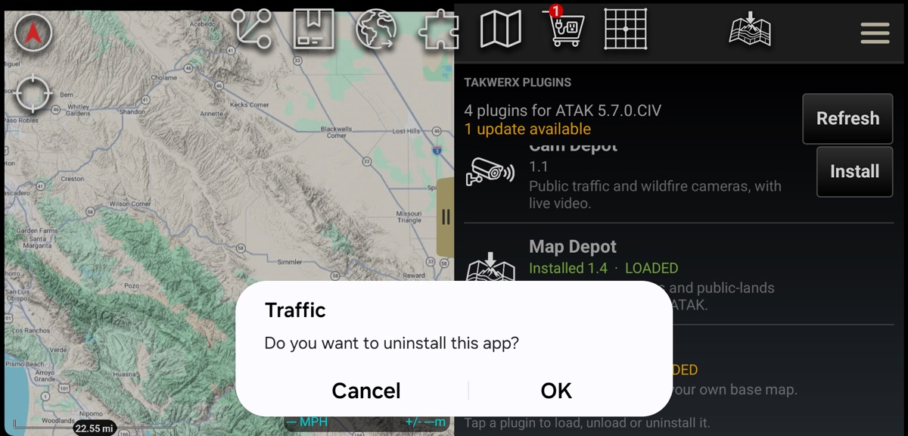

When it is gone, the row goes back to offering **Install**, the plugin's icon
leaves the toolbar, and the market's own toast says which one was removed.

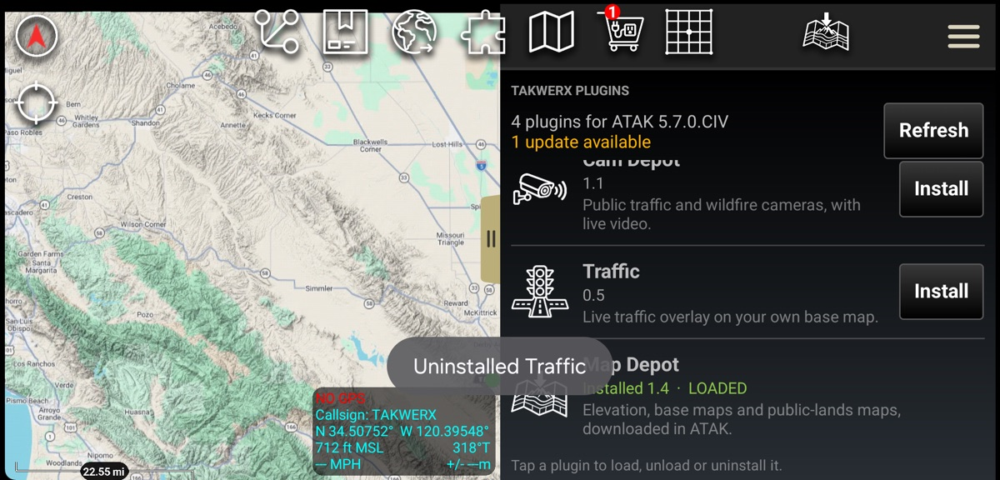

Uninstalling a plugin does not touch the data it downloaded into ATAK. Maps,
elevation and cameras are still there for the next install.

---

## All up to date

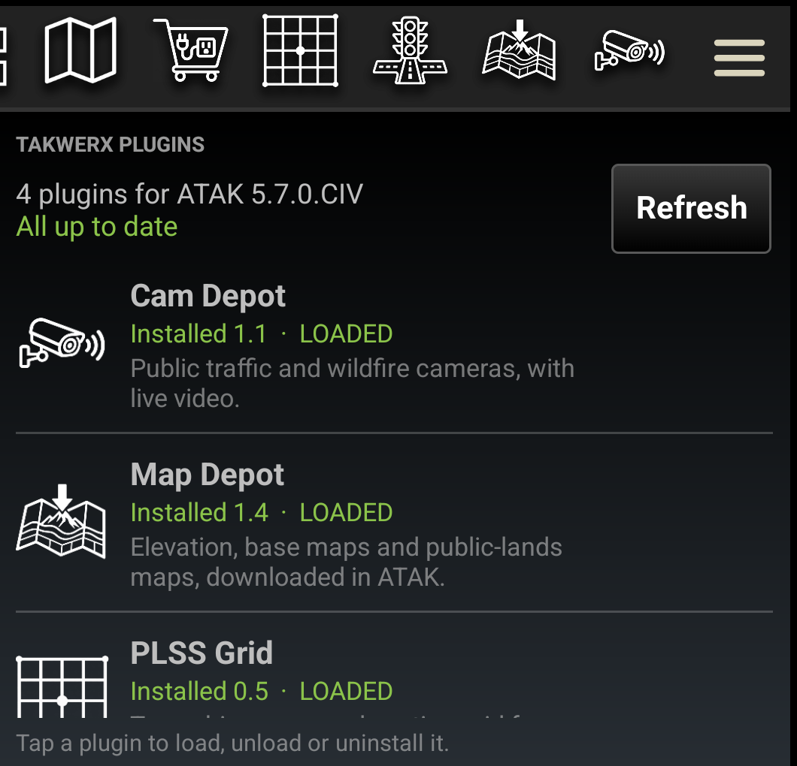

When every plugin is installed and current the header says so in green, the
count leaves the toolbar icon, and no row has a button.

If everything you have is current but some plugins are not installed, the header
says **No updates** and how many are not installed, so *all* is only ever said
when it means all.

### After an ATAK upgrade

Move from ATAK 5.7 to 5.8 and every plugin you had is still installed but was
built for 5.7, so ATAK marks it incompatible and it will not load. Get the 5.8
market from the downloads above, and each of those plugins shows up amber as
**built for 5.7.0.CIV → 5.8.0.CIV** with an **Update** button. One tap each and
you are moved over.

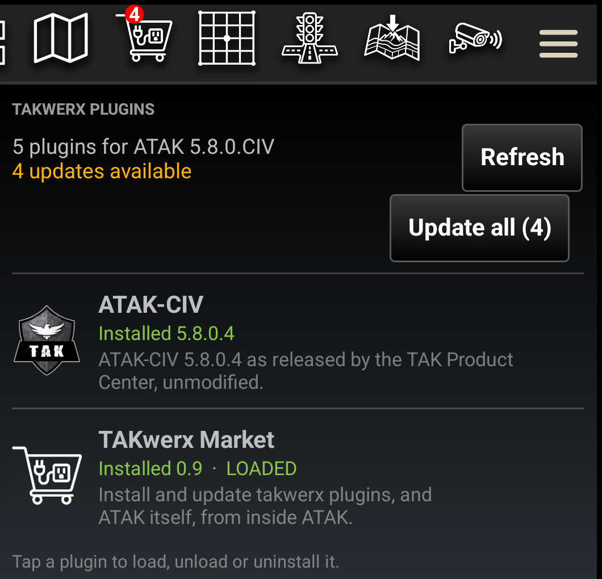

If you update ATAK yourself, you sideload the matching market once, because the
market you had was built for the old ATAK and will not load on the new one. If
the market updates ATAK, you do not: it puts its own new build on first.

The market also updates itself. When a new market is out it is a row like any
other; Update replaces it and ATAK asks to load the new one.

### Updating ATAK itself

When a newer ATAK-CIV is out, the market shows it as a row of its own, above
the plugins, with an **Update** button. If more than one newer release is
available the row says so, and Update asks which one you want. A same-release
update, 5.7.0.5 to 5.7.0.14 say, is simpler: ATAK alone goes to Android, and
the market and your plugins keep working as they are.

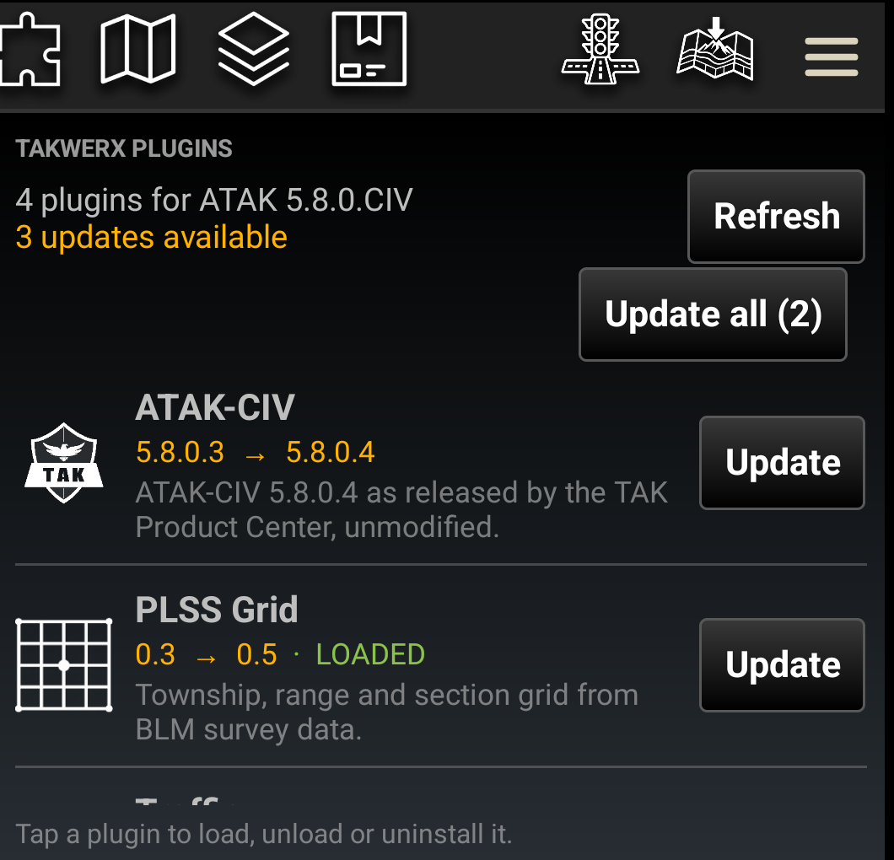

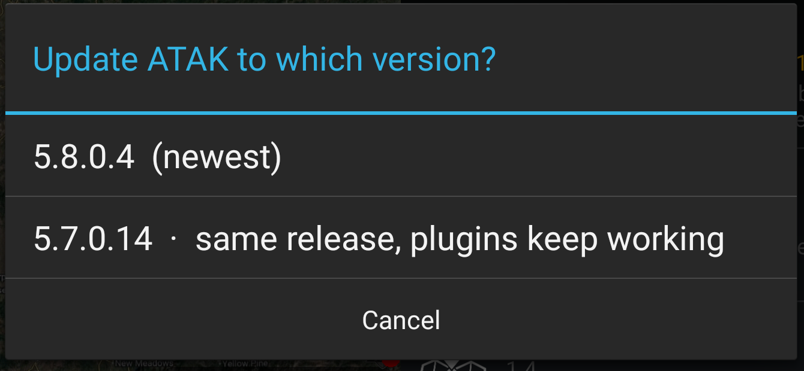

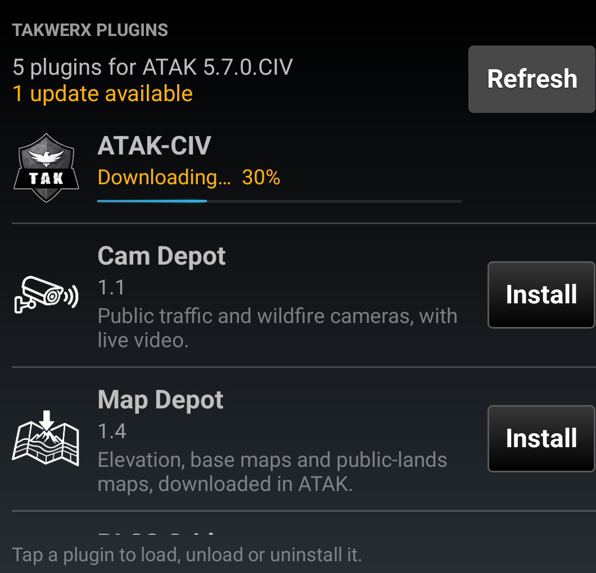

Tap it and read the warning, because this one restarts ATAK. The market
downloads ATAK (about 370 MB), then its own build for the new ATAK, and checks
both. Then two Android prompts, back to back: first the market's new build,
then ATAK. If ATAK asks to load TAKwerx Market between the two, tap Cancel; it
loads after the restart. Do not cancel the ATAK install once it starts.

ATAK comes back on the new version. Open the market: every plugin you had is
listed as *built for 5.7.0.CIV → 5.8.0.CIV*, and **Update all** moves them over
one after another, each with the same three screens as a single update.

The ATAK file is the TAK Product Center's own release, copied unchanged and
carrying its signature; the market checks that signature, and that the file is
the version it was told, before Android ever sees it. An ATAK that did not come
from tak.gov cannot be updated from here, and the market says so instead of
letting Android fail.

**Vector tile packages and ATAK 5.8.** ATAK 5.8.0.4 does not start with a
vector tile package (Map Depot's public-lands maps) on the phone. If you have
any, the market will not offer the 5.8 update, and says so. It comes back when
tak.gov ships a fixed ATAK. To update anyway, remove the packages from the phone
first (Map Depot's Offline Public Lands list can delete them), then tap Update
again.

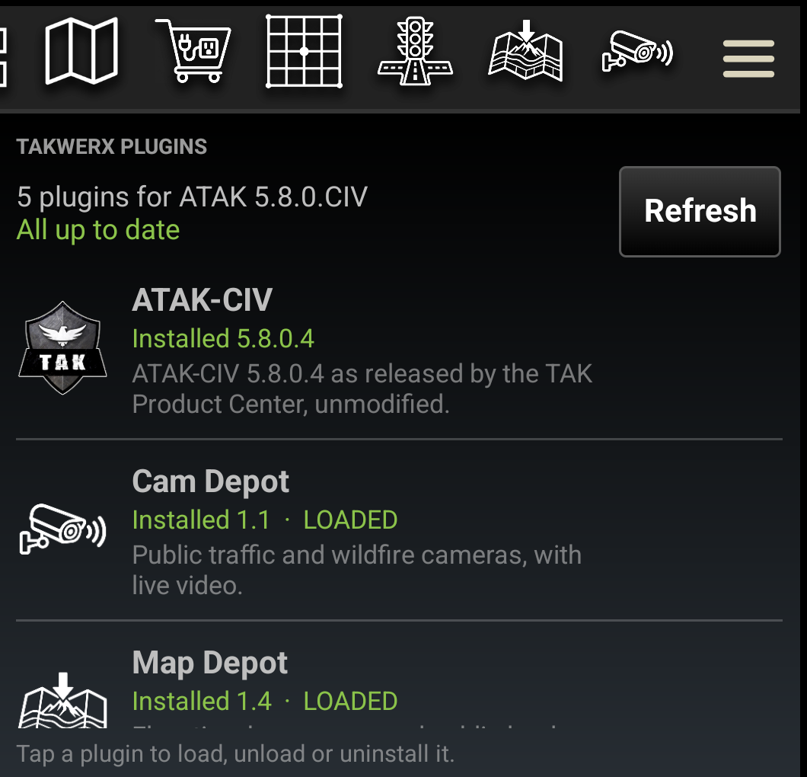

When it is done the header says **All up to date**, ATAK's own row reads
Installed with the new version, and the count leaves the toolbar icon. Nothing
you had downloaded into ATAK was touched.

### "signed with a different key"

If the market says a plugin on your device was signed with a different key, you
are running a build that did not come from tak.gov, usually a development build.
Android will not replace an app with one signed by a different key, so the market
offers to uninstall the one you have; then install from the market. This is
Android's rule, not the market's, and the market stops you before Android shows
its own less helpful message.

---

## Settings and this guide

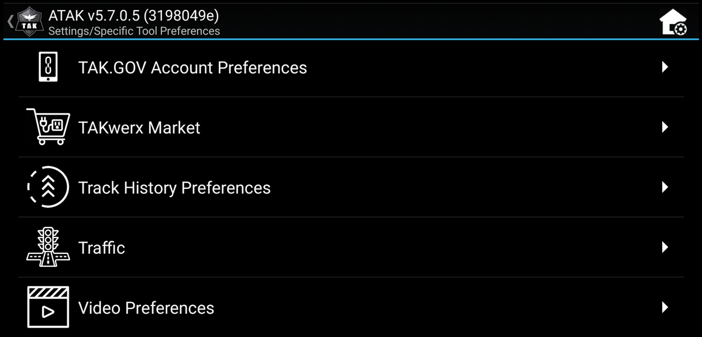

Settings → Tool Preferences → TAKwerx Market.

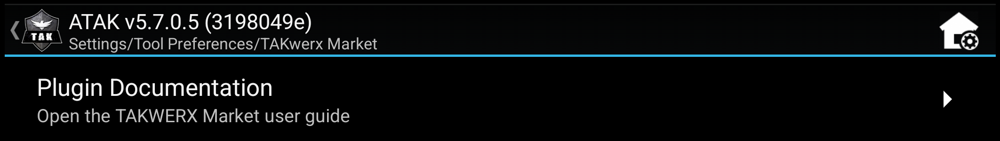

**Plugin Documentation** opens this guide on the device, as a PDF.

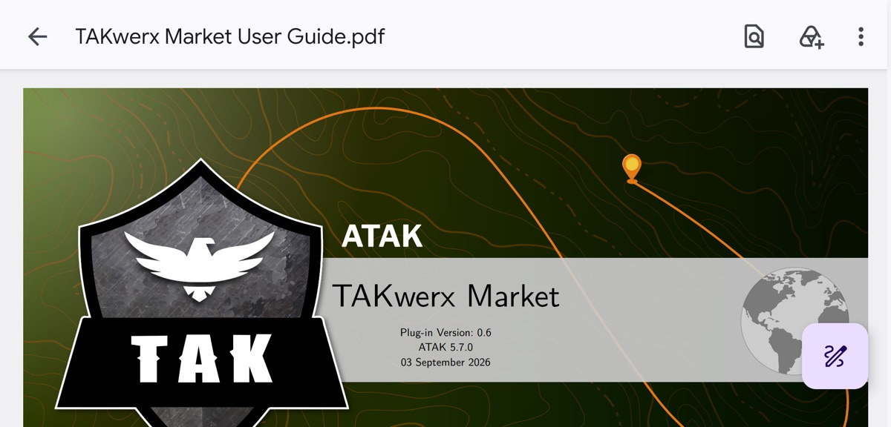

There is deliberately nothing else there. The market reads one list, the
TAKwerx one, and that cannot be changed from the device. ATAK can import
preferences from a data package, so a setting for it would be a way to point the
market somewhere else without you doing anything, and what the market offers you
is exactly the thing worth being sure about.

---

## Getting help

Every takwerx plugin has its own repository, with its downloads, its own guide
and its own issue tracker. If something in the market is wrong, raise it here:
https://github.com/takwerx/takwerx-market/issues
